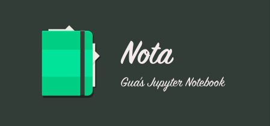

# nota

这是个人对于计算机科学及相关领域学习的个人记录笔记整理脱水版，其 *Jupyter Notebook* 服务搭建在个人的云服务器上，可随时进行记录。其领域包括以下几类：

* ML or DL
* iOS 学习记录（逆向工程及[源码 Probe]()手稿)
* Python 开发实战
* 前端领域开发实践（*React.js*, *Vue.js*, *React Native*, *Weapp 微信小程序*）

## 目录

* *Machine Learning* by *Dr. Zhou(Zhihua, Zhou)*
  * [Machine Learning 基础](https://github.com/Desgard/nota/blob/master/ml_learning/ch01_ml_Introduction.ipynb)
  * [模型评估与选择](https://github.com/Desgard/nota/blob/master/ml_learning/ch02_model_evaluation_and_selection.ipynb)
* [*Machine Learning Crash Course* by Google](https://developers.google.com/machine-learning/crash-course/)
  * [机器学习术语](https://github.com/Desgard/nota/blob/master/ml_tensorflow/ch01_ml_introduction.ipynb)
* *iOS*日常学习小记录
  * [dyld 过程](https://github.com/Desgard/nota/blob/master/iOS_note/ch01_dyld_process.ipynb)
  
## 勘误与说明

可在 **issue** 区随时与我交流，该 Repo 仅用于个人学习笔记同步用，不做任何的发表和博客同步。
